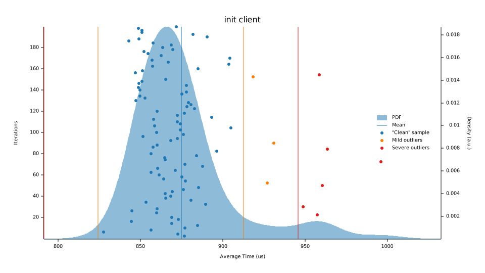
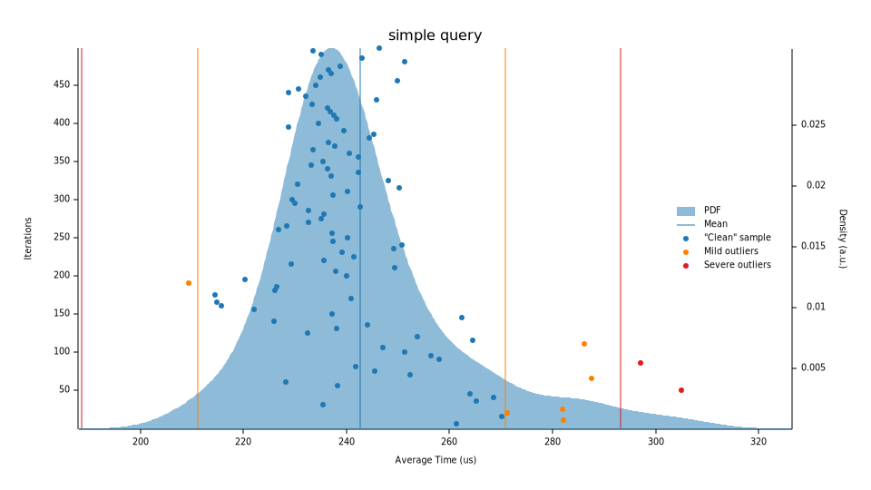
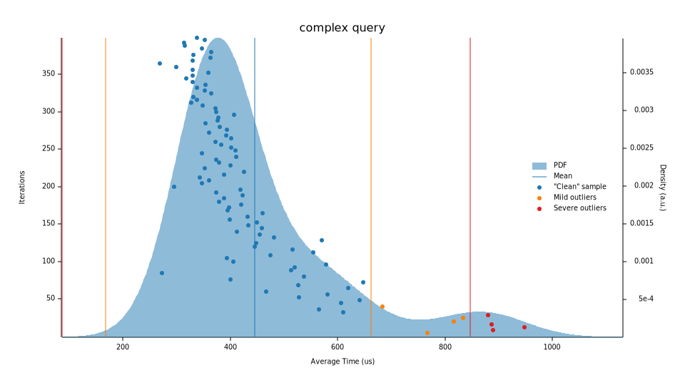

# bolt-rs

## Overview

This project aims to provide a comprehensive set of libraries that allow for interaction with graph database servers that
support the [Bolt](https://en.wikipedia.org/wiki/Bolt_%28network_protocol%29) protocol, namely, [Neo4j](https://neo4j.com).
This set of libraries allows interacting with servers supporting versions 1 through 4 of the protocol, which includes
Neo4j 4.0.

### bolt-proto

Contains the traits and primitives used in the protocol. The `Message` and `Value` enums are of particular importance,
and are the primary units of information sent and consumed by Bolt clients/servers.

### bolt-client

Contains an asynchronous client for Bolt-compatible servers, using a TCP stream optionally secured using
TLS.

### bb8-bolt

A bolt-client adapter crate for the [bb8](https://crates.io/crates/bb8) connection pool.

### bolt-proto-derive

Procedural macros used in bolt-proto to derive serialization-related traits.

### bolt-client-macros

Procedural macros used in bolt-client for client version requirements and smarter tests.

## Benchmarks

Disclaimer: I'm not a benchmark guru, I just did some quick analysis with [criterion](https://crates.io/crates/criterion).

The following results were obtained using bolt-client, with a Neo4j 4.0 server running in a docker container on the same
machine (a laptop running 64-bit Linux). The client communicated with the server using version 3 of the Bolt protocol.

### Basic client initialization

This measured the time it took to initialize a new client instance: performing a handshake to establish a protocol 
version, sending a HELLO message to the server, and receiving a SUCCESS message.

Here are some statistics from criterion:

|           | Lower bound | Estimate  | Upper bound |
|-----------|-------------|-----------|-------------|
| Mean      | 869.41 us   | 874.76 us | 880.61 us   |
| Std. Dev. | 21.156 us   | 28.821 us | 35.426 us   |
| Median    | 864.63 us   | 868.97 us | 873.53 us   |
| MAD       | 13.386 us   | 17.213 us | 22.078 us   ||

### Simple query execution

This measured the time it took to execute a simple query (`RETURN 1 as num;`) using a pre-initialized client. This
involved sending a RUN_WITH_METADATA message, then a PULL_ALL message, and fetching/deserializing the response.

Here are some statistics from criterion:

|           | Lower bound | Estimate  | Upper bound |
|-----------|-------------|-----------|-------------|
| Mean      | 239.39 us   | 242.61 us | 246.00 us   |
| Std. Dev. | 13.189 us   | 16.885 us | 20.167 us   |
| Median    | 236.79 us   | 238.03 us | 240.63 us   |
| MAD       | 6.7203 us   | 10.142 us | 13.585 us   |

### Complex query execution

This measured the time it took to execute a more complex query (a `MATCH` between 2 nodes and 1 relationship) using a
pre-initialized client. It involved deserializing more messages and complex nested data structures.

Here are some statistics from criterion:

|           | Lower bound | Estimate  | Upper bound |
|-----------|-------------|-----------|-------------|
| Mean      | 418.30 us   | 445.29 us | 474.45 us   |
| Std. Dev. | 111.01 us   | 144.67 us | 172.97 us   |
| Median    | 378.30 us   | 396.89 us | 411.14 us   |
| MAD       | 52.691 us   | 75.039 us | 100.26 us   |

## Contributing

Bug reports and pull requests are welcome on GitHub at https://github.com/lucis-fluxum/bolt-rs.

## License

These crates are available as open source under the terms of the [MIT License](http://opensource.org/licenses/MIT), with
portions of the documentation licensed under the 
[Creative Commons Attribution-ShareAlike 3.0 License](https://creativecommons.org/licenses/by-sa/3.0/).

Unless you explicitly state otherwise, any contribution intentionally submitted for inclusion in `bolt-rs` by you shall
be licensed as MIT, without any additional terms or conditions.
